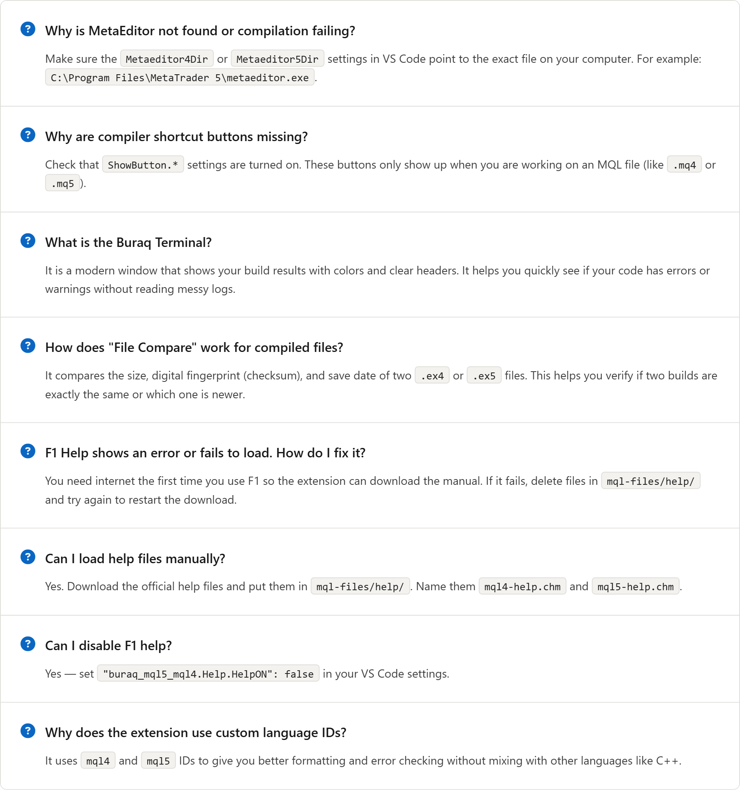

# Buraq MQL5 & MQL4

<p align="left">
  A premium Visual Studio Code extension delivering comprehensive language support, compilation workflows, and developer productivity tools for MetaQuotes Language (MQL4/MQL5) used in MetaTrader platforms.
</p>

<p align="left">  &nbsp;&nbsp;<a href="https://marketplace.visualstudio.com/items?itemName=sarfrazfrompk.buraq-mql5-mql4" style="text-decoration: none;"></a>&nbsp;&nbsp;</p>


---


## 🚀 Features

<p align="center">
  
</p>

---

## 📦 Installation

### From Marketplace

Search for `Buraq MQL5 & MQL4` in the Extensions panel (<kbd>Ctrl</kbd> + <kbd>Shift</kbd> + <kbd>X</kbd>), or install directly via CLI:

```bash
code --install-extension sarfrazfrompk.buraq-mql5-mql4
```

- 🛒 **Marketplace**: https://marketplace.visualstudio.com/items?itemName=sarfrazfrompk.buraq-mql5-mql4
- 🐙 **GitHub**: https://github.com/sarfrazfrompk/buraq-mql5-mql4

### From VSIX (Local Build)

```bash
# Install the VSCE packaging tool
npm install -g vsce

# Build a VSIX package from the project root
vsce package

# Install the generated package
code --install-extension ./buraq-mql5-mql4-0.8.0.vsix
```

---

## 🛠️ Usage

1. Open any `.mq4`, `.mq5`, or `.mqh` file — the extension activates automatically.
2. Use the **Editor Title Bar Buttons** or the **Command Palette** (<kbd>Ctrl</kbd> + <kbd>Shift</kbd> + <kbd>P</kbd>) to trigger compile actions.
3. Right-click anywhere in an MQL document to access **Context Menu** helpers for inserting headers, resources, and comment blocks.

### ⌨️ Keybindings

| Action | Shortcut |
|---|---|
| 🔨 Compile MQL File | <kbd>Ctrl</kbd> + <kbd>Shift</kbd> + <kbd>X</kbd> |
| 🔍 Check File Syntax | <kbd>Ctrl</kbd> + <kbd>Shift</kbd> + <kbd>Z</kbd> |
| 🚀 Compile using Script | <kbd>Ctrl</kbd> + <kbd>Shift</kbd> + <kbd>C</kbd> |
| 📖 Open MQL Help Reference | <kbd>F1</kbd> |

---

## ⚙️ Configuration

Configure the extension under **Settings** (<kbd>Ctrl</kbd> + <kbd>,</kbd>) or in `.vscode/settings.json`.

<details>
<summary>🔧 Click to expand Configuration Settings</summary>

| Setting Key | Type | Default | Description |
|---|---|---|---|
| `buraq_mql5_mql4.Metaeditor.Metaeditor4Dir` | string | `"C:\\MT4_Install\\MetaTrader\\metaeditor.exe"` | Path to MetaEditor (MT4) executable |
| `buraq_mql5_mql4.Metaeditor.Metaeditor5Dir` | string | `"C:\\MT5_Install\\MetaTrader\\metaeditor.exe"` | Path to MetaEditor (MT5) executable |
| `buraq_mql5_mql4.Metaeditor.Include4Dir` | string | `""` | Optional additional include directory for MT4 |
| `buraq_mql5_mql4.Metaeditor.Include5Dir` | string | `""` | Optional additional include directory for MT5 |
| `buraq_mql5_mql4.LogFile.DeleteLog` | boolean | `true` | Auto-delete temporary compilation logs |
| `buraq_mql5_mql4.LogFile.NameLog` | string | `""` | Custom log file path (auto-generated if empty) |
| `buraq_mql5_mql4.ShowButton.Compile` | boolean | `true` | Show Compile button in editor title bar |
| `buraq_mql5_mql4.ShowButton.Check` | boolean | `true` | Show Check button in editor title bar |
| `buraq_mql5_mql4.ShowButton.Script` | boolean | `true` | Show Script button in editor title bar |
| `buraq_mql5_mql4.Script.MiniME` | boolean | `true` | Minimize MetaEditor when compiling via script |
| `buraq_mql5_mql4.Script.Timetomini` | number | `500` (min `100`) | Delay before minimizing MetaEditor (ms) |
| `buraq_mql5_mql4.Script.CloseME` | boolean | `true` | Close MetaEditor after script finishes |
| `buraq_mql5_mql4.Help.HelpON` | boolean | `true` | Enable F1 offline help resolution |
| `buraq_mql5_mql4.Help.MQL4HelpLanguage` | string | `"English"` | Help language for MQL4 |
| `buraq_mql5_mql4.Help.MQL5HelpLanguage` | string | `"English"` | Help language for MQL5 |
| `buraq_mql5_mql4.Help.HelpVal` | number | `500` (min `150`) | Help operation timeout (ms) |
| `buraq_mql5_mql4.context` | boolean | `false` | Enable extra context menu commands in Explorer |
| `buraq_mql5_mql4.ShowChart.BrandingEnabled` | boolean | `true` | Enable MQL-Media branding on chart views |
| `buraq_mql5_mql4.ShowChart.BrandingPosition` | string | `"top-right"` | Branding position (`top-right`, `top-left`, `bottom-right`, `bottom-left`) |
| `buraq_mql5_mql4.author` | string | `"sarfrazfrompk"` | Author name inserted into new file templates |
| `buraq_mql5_mql4.link` | string | `"https://sarfrazfrompk.com"` | Author website inserted into new file templates |
| `buraq_mql5_mql4.codeLens.enabled` | boolean | `true` | Enable Code Lens reference count indicators |

</details>

---

## 🎨 Customizing Syntax Highlighting

You can customize MQL syntax colors using VS Code's `editor.tokenColorCustomizations` setting.

**Step 1**: Use <kbd>Ctrl</kbd> + <kbd>Shift</kbd> + <kbd>P</kbd> → **Developer: Inspect Editor Tokens and Scopes** to identify the TextMate scope of any token.

**Step 2**: Add your custom colors to `settings.json`:

```json
{
  "editor.tokenColorCustomizations": {
    "textMateRules": [
      {
        "scope": "comment.line.double-slash.mql",
        "settings": { "foreground": "#00FF00", "fontStyle": "italic" }
      },
      {
        "scope": "keyword.control.mql",
        "settings": { "foreground": "#569CD6", "fontStyle": "bold" }
      },
      {
        "scope": "entity.name.function.mql",
        "settings": { "foreground": "#DCDCAA" }
      },
      {
        "scope": "storage.type.mql",
        "settings": { "foreground": "#4EC9B0" }
      }
    ]
  }
}
```

<details>
<summary>📋 Common MQL TextMate Scopes</summary>

| Scope | Applies To |
|---|---|
| `comment.line.double-slash.mql` | Single-line comments `//` |
| `comment.block.mql` | Multi-line comments `/* */` |
| `keyword.control.mql` | Control statements (`if`, `else`, `for`, `while`) |
| `keyword.control.preprocessor.mql` | Preprocessor directives (`#include`, `#property`) |
| `storage.type.mql` | Primitive types (`int`, `double`, `string`, `bool`) |
| `storage.modifier.mql` | Modifiers (`extern`, `input`, `static`, `sinput`) |
| `entity.name.function.mql` | Function names |
| `string.quoted.double.mql` | String literals |
| `constant.numeric.integer.mql` | Integer constants |

</details>

---

## 📋 Commands Reference

<details>
<summary>📌 Click to expand full Commands list</summary>

| Command ID | Description |
|---|---|
| `buraq_mql5_mql4.compileFile` | Compile MQL file using MetaEditor |
| `buraq_mql5_mql4.checkFile` | Check MQL syntax without compiling |
| `buraq_mql5_mql4.compileScript` | Compile MQL file using automation script |
| `buraq_mql5_mql4.help` | Get MQL4/MQL5 help for word at cursor |
| `buraq_mql5_mql4.configurations` | Apply recommended VS Code settings for MQL |
| `buraq_mql5_mql4.Showfiles` | Toggle `.ex4`/`.ex5` binary file visibility |
| `buraq_mql5_mql4.openInME` | Open current file directly in MetaEditor |
| `buraq_mql5_mql4.commentary` | Insert standardized function block comment |
| `buraq_mql5_mql4.showChartView` | Show chart view panel with MQL-Media branding |
| `buraq_mql5_mql4.newExpertAdvisor` | Create a new Expert Advisor from template |
| `buraq_mql5_mql4.newIndicator` | Create a new Indicator from template |
| `buraq_mql5_mql4.newScript` | Create a new Script from template |
| `buraq_mql5_mql4.newLibrary` | Create a new Library from template |
| `buraq_mql5_mql4.quickFixAll` | Apply all available quick fixes in document |
| `buraq_mql5_mql4.detectIncludePaths` | Auto-detect MT4/MT5 Include directories |
| `buraq_mql5_mql4.autoConfigureIncludePaths` | Auto-configure detected Include paths in settings |
| `buraq_mql5_mql4.showCompiledFileInfo` | Display compiled binary metadata |
| `buraq_mql5_mql4.compareCompiledFiles` | Compare two compiled MQL binary outputs |
| `buraq_mql5_mql4.compileAllWorkspace` | Compile all non-ignored MQL files in workspace |
| `buraq_mql5_mql4.compileMainFile` | Compile the main `.mq5` file in workspace root |

</details>

---

## ❓ Troubleshooting & FAQ

<p align="center">
  
</p>

---

## 🤝 Contributing

1. Fork the repository and create a feature branch.
2. Install dependencies:
   ```bash
   pnpm install
   ```
3. Run lint:
   ```bash
   pnpm run lint
   ```
4. Follow conventional commits and open a Pull Request with a clear description.

---

## 🔗 Links

<p align="left">
  <a href="https://sarfrazfrompk.com"></a>
  <a href="https://github.com/sarfrazfrompk/buraq-mql5-mql4"></a>
  </p>
  <p align="left">
  <a href="https://www.linkedin.com/in/sarfrazfrompk/"></a>
  <a href="https://sarfrazfrompk.com/contact"></a>
  <a href="https://www.facebook.com/groups/mql5programmers"></a>
</p>

---

## 📄 License

Released under the **PolyForm Noncommercial License 1.0.0**. See [LICENSE.md](LICENSE.md) for details.